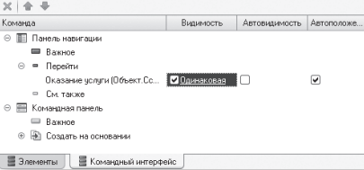

# Примеры из методичек, курсов


## Использование критерия отбора (Отображение для клиентов документов введенных на основании) 

После создания критерия отбора переходим на закладку Данные выбираем тип используемого критерия – СправочникСсылка.Клиенты.

На закладке Состав в качестве объектов, входящих в критерий, выберем реквизит ОбъектОснование документа ОказаниеУслуги, который является Клиентом для данного документа.


После этого в панели навигации формы элемента справочника Клиенты в группе Перейти появится команда для открытия критерия отбора.




## Добавление параметризованной команды для отображения у складов на форме - команды, для открытия отчета по данному складу

#### Код команды


```
&НаКлиенте
Процедура ОбработкаКоманды(ПараметрКоманды, ПараметрыВыполненияКоманды)
   ПараметрыФормы = Новый Структура("Отбор, КлючНазначенияИспользования, СформироватьПриОткрытии", Новый Структура("Склад",
   ПараметрКоманды), "ОстаткиПоСкладу", Истина);
   ОткрытьФорму("Отчет.Материалы.Форма", ПараметрыФормы, ПараметрыВыполненияКоманды.Источник, Истина, ПараметрыВыполненияКоманды.Окно);
КонецПроцедуры
```


## Добавление итога по сумме в подвал таблицы на форме


## Сворачиваемая группа на форме


## Группировка списка формы документа по клиентам  


## Открытие формы выбора

#### Подбор с параметрами - не закрывать при выборе и возможнстью множественного выбора

```bsl
&НаКлиенте
Процедура Подбор(Команда)
   ПараметрыФормы = Новый Структура("ЗакрыватьПриВыборе, МножественныйВыбор", Ложь, Истина);
   ОткрытьФорму("Справочник.Номенклатура.ФормаВыбора", ПараметрыФормы, Элементы.Материалы);
КонецПроцедуры
```

#### Подбор с вопросом, немодальным способом 

```bsl
&НаКлиенте
Процедура ПодборВопрос(Команда)
   Оповещение = Новый ОписаниеОповещения("ПодборЗавершение", ЭтотОбъект);
   ПоказатьВопрос(Оповещение, "Подобрать номенклатуру в документ?",
   РежимДиалогаВопрос.ДаНет);
КонецПроцедуры

&НаКлиенте
Процедура ПодборЗавершение(Результат, Параметры) Экспорт
   Если Результат = КодВозвратаДиалога.Да Тогда
      ПараметрыФормы = Новый Структура("МножественныйВыбор", Истина);
      ОткрытьФорму("Справочник.Номенклатура.ФормаВыбора", ПараметрыФормы, Элементы.Материалы);
   КонецЕсли;
КонецПроцедуры
```


#### Код обработчика выбора 
```bsl
&НаКлиенте
Процедура МатериалыОбработкаВыбора(Элемент, ВыбранноеЗначение, СтандартнаяОбработка)
   Элементы.Материалы.ДобавитьСтроку();
   Элементы.Материалы.ТекущиеДанные.Материал = ВыбранноеЗначение;

   //Для Каждого ВыбранныйЭлемент Из ВыбранноеЗначение Цикл
   //  НоваяСтрока = Объект.Материалы.Добавить();
   //  НоваяСтрока.Материал = ВыбранныйЭлемент;
   //КонецЦикла;

КонецПроцедуры
```


## Открыть из формы списка справочника "Сотрудники" форму списка документа "ОказаниеУслуг" с отбором по реквизиту выбранной строки   
```bsl
ПараметрыФормы = Новый Структура("Отбор", Новый Структура("Мастер", Элементы.Список.ТекущаяСтрока));
ОткрытьФорму("Документ.ОказаниеУслуги.ФормаСписка", ПараметрыФормы,, Истина);
```

## Изменение настроек фиксированных на обычные настройки
```bsl
&НаСервере
Процедура ПриСозданииНаСервере(Отказ, СтандартнаяОбработка)
   Если Параметры.Отбор.Свойство("Мастер") Тогда
      ПрограммныйОтбор = Истина;
      ПолеОтбора = Новый ПолеКомпоновкиДанных("Мастер");
      Параметры.Отбор.Свойство("Мастер", ЗначениеОтбора);
   КонецЕсли
КонецПроцедуры

&НаКлиенте
Процедура ПриОткрытии(Отказ)
   Если ПрограммныйОтбор = Истина Тогда
      ПрограммныеНастройки = Список.КомпоновщикНастроек.ФиксированныеНастройки;
      Для Каждого ЭлементНастроек Из ПрограммныеНастройки.Отбор.Элементы Цикл
         Если ЭлементНастроек.ЛевоеЗначение = ПолеОтбора Тогда
            ПрограммныеНастройки.Отбор.Элементы.Удалить(ЭлементНастроек);
         КонецЕсли;
      КонецЦикла;
      Настройки = Список.КомпоновщикНастроек.Настройки;
      ЭлементОтбора = Настройки.Отбор.Элементы.Добавить(Тип("ЭлементОтбораКомпоновкиДанных"));
      ЭлементОтбора.ЛевоеЗначение = ПолеОтбора;
      ЭлементОтбора.ВидСравнения = ВидСравненияКомпоновкиДанных.Равно;
      ЭлементОтбора.ПравоеЗначение = ЗначениеОтбора;
      Список.КомпоновщикНастроек.ЗагрузитьНастройки(Настройки);
   КонецЕсли;
КонецПроцедуры
```


## Добавление сообщения для уточнения закрытия приложения
```bsl
Процедура ПередЗавершениемРаботыСистемы(Отказ, ТекстПредупреждения)
   Отказ = Истина;
   ТекстПредупреждения = "Вы действительно хотите выйти?";
КонецПроцедуры
```


## Создание функции в общем модуле, которая проверяет год на високосность
```bsl
Функция ЭтоВисокосныйГод(Год) Экспорт
   ПоследнийДеньГода = Дата(Год, 12, 31);
   Если ДеньГода(ПоследнийДеньГода) = 366 Тогда
      Возврат Истина;
   Иначе 
      Возврат Ложь;
   КонецЕсли;
КонецФункции
```
> В свойствах модуля управляемого приложения выбираем свойство "Глобальный" и "Клиент (управляемое приложение)"


## Считывание данных из загружаемого файла и добавление их в таблицу
```bsl
&НаКлиенте
Процедура ОбработкаКоманды(ПараметрКоманды, ПараметрыВыполненияКоманды)
   // 1. Получение пути к текстовому файлу
   Проводник = Новый ДиалогВыбораФайла(РежимДиалогаВыбораФайла.Открытие);
   Проводник.Фильтр = "Текстовый Документ (*.txt) | *.txt"; 
   Если Проводник.Выбрать() = Ложь Тогда
      Возврат;
   КонецЕсли;
   
   ПутьКФайлу = Проводник.ПолноеИмяФайла;
   
   // 2. Прочитать содержимое файла в строку
   Текст = Новый ТекстовыйДокумент;
   Текст.Прочитать(ПутьКФайлу, КодировкаТекста.UTF8);
   СтрокаТекста = Текст.ПолучитьТекст();

   ОбработкаКомандыНаСервере(СтрокаТекста);  
КонецПроцедуры


&НаСервере
Процедура ОбработкаКомандыНаСервере(СтрокаТекста)
   // 3. Создание таблицы значений  
   ТаблицаДанных = Новый ТаблицаЗначений;
   ТаблицаДанных.Колонки.Добавить("Номенклатура");
   ТаблицаДанных.Колонки.Добавить("Цена");
   
   // 4. Заполнение таблицы значений
   КоличествоСтрок = СтрЧислоСтрок(СтрокаТекста);  
   Для НомерСтроки = 1 По КоличествоСтрок Цикл     
      ТекСтрока = СтрПолучитьСтроку(СтрокаТекста, НомерСтроки);
      МассивСлов = СтрРазделить(ТекСтрока, ",");
      Если МассивСлов.Количество() = 0 Тогда
         Сообщить("Некорректный формат данных в строке №" + НомерСтроки);
         Продолжить; 
      КонецЕсли;           
      
      СтрокаТаблицы = ТаблицаДанных.Добавить();
      СтрокаТаблицы.Номенклатура = МассивСлов[0];
      СтрокаТаблицы.Цена = МассивСлов[1];
   КонецЦикла;
   
   Для Каждого СтрокаТаблицы Из ТаблицаДанных Цикл 
      Сообщить(СтрокаТаблицы.Номенклатура + " | " + СтрокаТаблицы.Цена);      
   КонецЦикла; 
КонецПроцедуры
```


## Работа с документом

```bsl
&НаКлиенте
Процедура ИзменитьДокумент(Команда)
   ИзменитьДокументНаСервере();
КонецПроцедуры


&НаСервере
Процедура ИзменитьДокументНаСервере()
   НайденныйДокумент = Документы.ПоступлениеТоваров.НайтиПоНомеру("000000001");
   Если НайденныйДокумент = Документы.ПоступлениеТоваров.ПустаяСсылка() Тогда
      Возврат;
   КонецЕсли;
   
   ДокОбъект = НайденныйДокумент.ПолучитьОбъект();
   НоваяСтрока = ДокОбъект.Товары.Добавить();
   НоваяСтрока.Номенклатура = Справочники.Номенклатура.НайтиПоНаименованию("Молоток");
   НоваяСтрока.Количество = 11;
   НоваяСтрока.Цена = 10;
   НоваяСтрока.Сумма = НоваяСтрока.Количество * НоваяСтрока.Цена;   
   ДокОбъект.Записать(РежимЗаписиДокумента.Проведение);
КонецПроцедуры

&НаКлиенте
Процедура ПометитьНаУдаление(Команда)
   ПометитьНаУдалениеНаСервере();
КонецПроцедуры


&НаСервере
Процедура ПометитьНаУдалениеНаСервере()
   НайденныйДокумент = Документы.ПоступлениеТоваров.НайтиПоНомеру("000000001");
   Если НайденныйДокумент = Документы.ПоступлениеТоваров.ПустаяСсылка() Тогда
      Возврат;
   КонецЕсли;
   
   ДокОбъект = НайденныйДокумент.ПолучитьОбъект();
   ДокОбъект.УстановитьПометкуУдаления(Истина);
   ДокОбъект.Записать();
КонецПроцедуры


&НаКлиенте
Процедура ВыбратьДокументы(Команда)
   ВыбратьДокументыНаСервере();
КонецПроцедуры


&НаСервере
Процедура ВыбратьДокументыНаСервере()
   Выборка = Документы.ПоступлениеТоваров.Выбрать();
   Пока Выборка.Следующий() Цикл
      Сообщить(Выборка.Номер);
   КонецЦикла;
КонецПроцедуры
```


## Работа с регистром сведений

Для регистра сведений может использоваться периодичность в основных настройках, которая позволяет получать срез первых и срез последних. При указании в режиме записи параметра пользователь сам добавляет запись в регистр, в то время как другой вариант (подчинение регистратору) переносит записи в регистр при проведении документа и каждая запись связана с конкретным документом.

Для периодического регистра сведений "Получить последнее" выбирает значение предыдущего последнего значение от выбранной даты, а "Получить первое" следующее ближайшее значение от выбранной даты.

```bsl
&НаКлиенте
Процедура СоздатьЗаписи(Команда)
   СоздатьЗаписиНаСервере();
КонецПроцедуры


&НаСервере
Процедура СоздатьЗаписиНаСервере()
   // Создание одиночной записи в регистре
   МенеджерЗаписи = РегистрыСведений.КурсыВалют.СоздатьМенеджерЗаписи();
   МенеджерЗаписи.Период = ТекущаяДата();
   МенеджерЗаписи.Валюта = Справочники.Валюты.USD;
   МенеджерЗаписи.Курс = 2.02;
   МенеджерЗаписи.Кратность = 1;
   МенеджерЗаписи.Записать();
   

   // Создание записей за месяц на каждый день
   НаборЗаписей = РегистрыСведений.КурсыВалют.СоздатьНаборЗаписей();
   НачМесяца = НачалоМесяца(ТекущаяДата());
   КонМесяца = КонецМесяца(ТекущаяДата());
   
   ТекДень = НачМесяца;
   Пока ТекДень <= КонМесяца Цикл 
      НоваяЗапись = НаборЗаписей.Добавить();
      НоваяЗапись.Валюта = Справочники.Валюты.USD;
      НоваяЗапись.Период = ТекДень;
      НоваяЗапись.Курс = 2 + День(ТекДень)/100;
      НоваяЗапись.Кратность = 1;
      
      ТекДень = ТекДень + 86400;
   КонецЦикла;
   
   НаборЗаписей.Записать();
КонецПроцедуры


&НаКлиенте
Процедура ПоискВРегистре(Команда)
   ПоискВРегистреНаСервере();
КонецПроцедуры


&НаСервере
Процедура ПоискВРегистреНаСервере()
   СтруктураОтбора = Новый Структура("Валюта", Справочники.Валюты.USD);
   //СтруктураРезультата = РегистрыСведений.КурсыВалют.Получить('20191105', СтруктураОтбора); // Первый параметр - дата
   СтруктураРезультата = РегистрыСведений.КурсыВалют.ПолучитьПоследнее('20191105', СтруктураОтбора);
   Сообщить(СтруктураРезультата.курс); 
КонецПроцедуры


&НаКлиенте
Процедура ВыбратьЗаписи(Команда)
   ВыбратьЗаписиНаСервере();
КонецПроцедуры


&НаСервере
Процедура ВыбратьЗаписиНаСервере()
   НачМесяца = НачалоМесяца(ТекущаяДата());
   КонМесяца = КонецМесяца(ТекущаяДата());
   
   СтруктураОтбора = Новый Структура("Валюта", Справочники.Валюты.USD);
   
   Выборка = РегистрыСведений.КурсыВалют.Выбрать(НачМесяца, КонМесяца, СтруктураОтбора);
   Пока Выборка.Следующий() Цикл 
      Сообщить(Выборка.Курс);
   КонецЦикла;
КонецПроцедуры


&НаКлиенте
Процедура ИзменитьЗаписи(Команда)
   ИзменитьЗаписиНаСервере();
КонецПроцедуры


&НаСервере
Процедура ИзменитьЗаписиНаСервере()
   //1. создать набор записей
   НаборЗаписей = РегистрыСведений.КурсыВалют.СоздатьНаборЗаписей();
   
   //2. наложить отбор по измерениям
   НаборЗаписей.Отбор.Валюта.Установить(Справочники.Валюты.USD);
   
   //3. прочитать данные в набор записей
   НаборЗаписей.Прочитать();
   
   //4. изменение записей
   Для Каждого Запись Из НаборЗаписей Цикл
      Запись.Курс = Запись.Курс + 0.01;
   КонецЦикла;
   
   //5. запись набора записей 
   НаборЗаписей.Записать();   
КонецПроцедуры


&НаКлиенте
Процедура УдалитьЗаписи(Команда)
   УдалитьЗаписиНаСервере();
КонецПроцедуры


&НаСервере
Процедура УдалитьЗаписиНаСервере()
   //1. создать набор записей
   НаборЗаписей = РегистрыСведений.КурсыВалют.СоздатьНаборЗаписей();
   
   //2. наложить отбор по измерениям
   НаборЗаписей.Отбор.Валюта.Установить(Справочники.Валюты.EUR);
   
   //3. запись пустого набора записей
   НаборЗаписей.Записать();
КонецПроцедуры


&НаКлиенте
Процедура ОчиститьРегистр(Команда)
   ОчиститьРегистрНаСервере();
КонецПроцедуры


&НаСервере
Процедура ОчиститьРегистрНаСервере()
   //1. создать набор записей
   НаборЗаписей = РегистрыСведений.КурсыВалют.СоздатьНаборЗаписей();
   
   //2. запись пустого набора
   НаборЗаписей.Записать();
КонецПроцедуры
```


## Работа с регистром накопления
```bsl
&НаКлиенте
Процедура ПолучитьДвиженияДокумента(Команда)
   ПолучитьДвиженияДокументаНаСервере();
КонецПроцедуры


&НаСервере
Процедура ПолучитьДвиженияДокументаНаСервере()
   СсылкаНаДокумент = Документы.ПоступлениеТоваров.НайтиПоНомеру("000000001");

   Выборка = РегистрыНакопления.ОстаткиТоваров.ВыбратьПоРегистратору(СсылкаНаДокумент);
   Пока Выборка.Следующий() Цикл
      Сообщить(Выборка.Номенклатура);
   КонецЦикла;
КонецПроцедуры


&НаКлиенте
Процедура ПолучитьОстатки(Команда)
   ПолучитьОстаткиНаСервере();
КонецПроцедуры


&НаСервере
Процедура ПолучитьОстаткиНаСервере()

   СтруктураОтбора = Новый Структура("Номенклатура", Справочники.Номенклатура.НайтиПоНаименованию("Газонокосилка"));
   ТаблицаОстатков = РегистрыНакопления.ОстаткиТоваров.Остатки(ТекущаяДата(), СтруктураОтбора);

   Для Каждого СтрокаОстатков Из ТаблицаОстатков Цикл
      Сообщить("" + СтрокаОстатков.Номенклатура + " " + СтрокаОстатков.Количество);
   КонецЦикла;
КонецПроцедуры


&НаКлиенте
Процедура ПолучитьОбороты(Команда)
   ПолучитьОборотыНаСервере();
КонецПроцедуры


&НаСервере
Процедура ПолучитьОборотыНаСервере()
   СтруктураОтбора = Новый Структура("Номенклатура", Справочники.Номенклатура.НайтиПоНаименованию("Газонокосилка"));
   ТаблицаОборотов = РегистрыНакопления.ОстаткиТоваров.Обороты(НачалоМесяца(ТекущаяДата()), КонецМесяца(ТекущаяДата()), СтруктураОтбора);

   Для Каждого СтрокаОборотов Из ТаблицаОборотов Цикл
      Сообщить("" + СтрокаОборотов.Номенклатура + " " + СтрокаОборотов.КоличествоПриход + " " + СтрокаОборотов.КоличествоРасход);
   КонецЦикла; 
КонецПроцедуры
```


## Рассчет суммы по цене и количеству и скидки
```bsl
&НаСервере
Процедура ДатьСкидкуНаСервере()
   Для Каждого Стр Из Объект.Товары Цикл
      Стр.Цена = ПолучитьЦену(Стр.Товар);
      Стр.Цена = Стр.Цена * 0.9;
      Стр.Сумма = Стр.Цена * Стр.Количество;
   КонецЦикла;
КонецПроцедуры


&НаКлиенте
Процедура ДатьСкидку(Команда)
   ДатьСкидкуНаСервере();
КонецПроцедуры


&НаКлиенте
Процедура ТоварыКоличествоПриИзменении(Элемент)
   Стр = Элементы.Товары.ТекущиеДанные;
   РассчитатьСумму(Стр);
КонецПроцедуры


&НаКлиенте
Процедура ТоварыЦенаПриИзменении(Элемент)
   Стр = Элементы.Товары.ТекущиеДанные;
   РассчитатьСумму(Стр);
КонецПроцедуры


&НаКлиентеНаСервереБезКонтекста
Процедура РассчитатьСумму(Стр)
   Стр.Сумма = Стр.Цена * Стр.Количество;
КонецПроцедуры
```


## Использование временного хранилища для передачи выгруженных товаров

```bsl
&НаСервере
Функция ОткрытьПодборНаСервере()
   ТЗ = Объект.Товары.Выгрузить();
   Адрес = ПоместитьВоВременноеХранилище(ТЗ);
   Возврат Адрес;
КонецФункции


&НаКлиенте
Процедура ОткрытьПодбор(Команда)
   АдресВХ = ОткрытьПодборНаСервере();

   Парам = Новый Структура();
   Парам.Вставить("Склад", Объект.Склад);
   Парам.Вставить("АдресВХ", АдресВХ);

   ОткрытьФорму("Справочник.Товары.Форма.ФормаПодбора", Парам, ЭтаФорма);
КонецПроцедуры


&НаКлиенте
Процедура ЗавершитьПодбор(АдресВХ) Экспорт
   Объект.Товары.Загрузить(ПолучитьИзВременногоХранилища(АдресВХ));
КонецПроцедуры


&НаСервере
Процедура ЗавершитьПодборНаСервере(АдресВХ)
   Объект.Товары.Загрузить(ПолучитьИзВременногоХранилища(АдресВХ));
КонецПроцедуры
```


### Форма подбора
```bsl
&НаСервере
Процедура ПриСозданииНаСервере(Отказ, СтандартнаяОбработка)
   Список.Параметры.УстановитьЗначениеПараметра("Склад", Параметры.Склад);
   ТЗ = ПолучитьИзВременногоХранилища(Параметры.АдресВХ);
   ВыбранныеТовары.Загрузить(ТЗ);
КонецПроцедуры


&НаСервере
Функция ЗавершитьПодборНаСервере()
   Возврат ПоместитьВоВременноеХранилище(ВыбранныеТовары.Загрузить());
КонецФункции


&НаКлиенте
Процедура ЗавершитьПодбор(Команда)
   АдресВХ = ЗавершитьПодборНаСервере();
   ВладелецФормы.ЗавершитьПодбор(АдресВХ);
   Закрыть();
КонецПроцедуры
```


## Загружаем картинку на форму

В справочнике в разделе "Данные" создаем реквизит "ДанныеФото" с типом ХранилищеЗначения. В форме элемента для реквизита "ДанныеФото" указывается тип - Строка.


### Модуль формы элемента для команды "ЗагрузитьФото"
```bsl
&НаКлиенте
Процедура ЗагрузитьФото(Команда)
   АдресВХ = "";
   НачатьПомещениеФайла(Новый ОписаниеОповещения("ЗагрузитьФотоЗавершение"), ЭтотОбъект, Новый Структура("АдресВХ", АдресВХ)), АдресВХ,, Истина, УникальныйИдентификатор);
КонецПроцедуры


&НаКлиенте
Процедура ЗагрузитьФотоЗавершение(Результат, Адрес, ВыбранноеИмяФайла, ДополнительныеПараметры) Экспорт
   Если Результат Тогда
      Картинка = Адрес;
      Модифицированность = Истина;
   КонецЕсли;
КонецПроцедуры


&НаСервере
Процедура ПередЗаписьюНаСервере(Отказ, ТекущийОбъект, ПараметрыЗаписи)
   Если ЭтоАдресВременногоХранилища(Картинка) Тогда
      ТекущийОбъект.ДанныеФото = Новый ХранилищеЗначения(ПолучитьИзВременногоХранилища(Картинка));
   КонецЕсли;
КонецПроцедуры


&НаСервере
Процедура ПриСозданииНаСервере(Отказ, СтандартнаяОбработка)
   Картинка = ПолучитьНавигационнуюСсылку(Объект.Ссылка, "ДанныеФото");
КонецПроцедуры
```


## Печатные формы


Печатная форма состоит из Шапки, Табличной части, Подвала.

Печатная форма получается исходя из макета и программного кода.

Любой текст который мы хотим отобразить в печатной форме должен находится в какой-либо области("Заголовок", "Шапка", "Подвал" и т.д.), а также быть прописан в программном коде.

Для создания области необходимо ведилить строки и назначить имя в меню "Таблица - Имена - Назначит имя..."

Для добавления строк в области нужно вызвать контекстное меню и выбрать команду "Раздвинуть".


### Печатная форма 1


#### Печать из формы

Модуль формы
```bsl
&НаСервере
Процедура Печать1НаСервере(ТД)
   Док = РеквизитФормыВЗначение("Объект");
   Док.Печать1(ТД);
КонецПроцедуры


&НаКлиенте
Процедура Печать1(Команда)
   ТД = Новый ТабличныйДокумент;
   Печать1НаСервере(ТД);
   ТД.Показать();
КонецПроцедуры
```

Модуль объекта
```bsl
Процедура Печать1(ТД) Экспорт
   Макет = Документы.СчетНаОплатуПокупателю.ПолучитьМакет("Макет");
   Макет.Параметры.Заполнить(ЭтотОбъект);
   ТД.Вывести(Макет);
КонецПроцедуры
```


#### Печать из команды


Модуль команды
```bsl
&НаКлиенте
Процедура ОбработкаКоманды(ПараметрКоманды, ПараметрыВыполненияКоманды)
   ТД = Новый ТабличныйДокумент;
   Печать2(ТД, ПараметрКоманды);
   ТД.Показать();
КонецПроцедуры


&НаСервере
Процедура Печать2(ТД, ПараметрКоманды)
   Для Каждого Док Из ПараметрКоманды Цикл
      Документы.СчетНаОплатуПокупателю.Печать2(ТД, Док);
   КонецЦикла;
КонецПроцедуры
```

Модуль менеджера
```bsl
Процедура Печать2(ТД, Док) Экспорт
   Макет = Документы.СчетНаОплатуПокупателю.ПолучитьМакет("Макет");
   Макет.Параметры.Заполнить(Док);
   ТД.Вывести(Макет);
КонецПроцедуры
```


### Печатная форма 2

Модуль менеджера документа "ПоступлениеТовара"
```bsl
Процедура Печать(ТабДок, Ссылка) Экспорт
   //{{_КОНСТРУКТОР_ПЕЧАТИ(Печать)
   Макет = Документы.ПоступлениеТоваров.ПолучитьМакет("Печать");
   Запрос = Новый Запрос;
   Запрос.Текст =
   "ВЫБРАТЬ
   |  ПоступлениеТоваров.Дата,
   |  ПоступлениеТоваров.Договор,
   |  ПоступлениеТоваров.Контрагент,
   |  ПоступлениеТоваров.Номер,
   |  ПоступлениеТоваров.СуммаДокумента,
   |  ПоступлениеТоваров.Товары.(
   |     НомерСтроки,
   |     Номенклатура,
   |     Количество,
   |     Цена,
   |     Сумма
   |  )
   |ИЗ
   |  Документ.ПоступлениеТоваров КАК ПоступлениеТоваров
   |ГДЕ
   |  ПоступлениеТоваров.Ссылка В (&Ссылка)";
   Запрос.Параметры.Вставить("Ссылка", Ссылка);
   Выборка = Запрос.Выполнить().Выбрать();

   ОбластьЗаголовок = Макет.ПолучитьОбласть("Заголовок");
   Шапка = Макет.ПолучитьОбласть("Шапка");
   ОбластьТоварыШапка = Макет.ПолучитьОбласть("ТоварыШапка");
   ОбластьТовары = Макет.ПолучитьОбласть("Товары");
   Подвал = Макет.ПолучитьОбласть("Подвал");

   ТабДок.Очистить();

   ВставлятьРазделительСтраниц = Ложь;
   Пока Выборка.Следующий() Цикл
      Если ВставлятьРазделительСтраниц Тогда
         ТабДок.ВывестиГоризонтальныйРазделительСтраниц();
      КонецЕсли;
      
      ОбластьЗаголовок.Параметры.Заполнить(Выборка);
      ОбластьЗаголовок.Параметры.Дата = Формат(Выборка.Дата,"ДФ=dd.MM.yy");
      ТабДок.Вывести(ОбластьЗаголовок);

      Шапка.Параметры.Заполнить(Выборка);
      ТабДок.Вывести(Шапка, Выборка.Уровень());

      ТабДок.Вывести(ОбластьТоварыШапка);
      ВыборкаТовары = Выборка.Товары.Выбрать();
      Пока ВыборкаТовары.Следующий() Цикл
         ОбластьТовары.Параметры.Заполнить(ВыборкаТовары);
         ТабДок.Вывести(ОбластьТовары, ВыборкаТовары.Уровень());
      КонецЦикла;

      Подвал.Параметры.Заполнить(Выборка);
      ТабДок.Вывести(Подвал);

      ВставлятьРазделительСтраниц = Истина;
   КонецЦикла;
   //}}
КонецПроцедуры
```


### Создание печатной формы по макету в Excel

Модуль команды
```bsl
&НаКлиенте
Процедура ОбработкаКоманды(ПараметрКоманды, ПараметрыВыполненияКоманды)
   ТабДок = Новый ТабличныйДокумент;
   Печать(ТабДок, ПараметрКоманды);
   ТабДок.Показать("Гарантийный талон");
КонецПроцедуры


&НаСервере
Процедура Печать(ТабДок, СсылкаНаДокумент)
   Документы.РеализацияТоваровУслуг.Печать(ТабДок, СсылкаНаДокумент);
КонецПроцедуры
```

Модуль менеджера
```bsl
Процедура Печать(ТабДок, СсылкаНаДокумент) Экспорт
   // Получить макет    
   Макет = Документы.РеализацияТоваровУслуг.ПолучитьМакет("ГарантийныйТалон");
   
   // Получение областей из макета
   ОбластьШапка = Макет.ПолучитьОбласть("Шапка");
   ОбластьШапкаТаблицы = Макет.ПолучитьОбласть("ШапкаТаблицы");
   ОбластьСтрокаТаблицы = Макет.ПолучитьОбласть("СтрокаТаблицы");
      ОбластьПодвал = Макет.ПолучитьОбласть("Подвал");
      ОбластьТекстСоглашения = Макет.ПолучитьОбласть("ТекстСоглашения");

   // Заполнение параметров и вывод областей в табличный документ
   
   // Шапка
   ОбластьШапка.Параметры.НазваниеОрганизации = Константы.НазваниеОрганизации.Получить();
   ОбластьШапка.Параметры.Номер = СсылкаНаДокумент.Номер;
   ОбластьШапка.Параметры.Дата = Формат(СсылкаНаДокумент.Дата, "ДЛФ=DD");    
   
   ТабДок.Вывести(ОбластьШапка);
   
   // Шапка таблицы        
   ТабДок.Вывести(ОбластьШапкаТаблицы);
   
   // Строка таблицы    
   Запрос = Новый Запрос;
   Запрос.Текст = 
      "ВЫБРАТЬ
      |  РеализацияТоваровУслугТовары.НомерСтроки,
      |  РеализацияТоваровУслугТовары.Номенклатура.НаименованиеДляПечати КАК НаименованиеДляПечати,
      |  РеализацияТоваровУслугТовары.Количество,
      |  РеализацияТоваровУслугТовары.Цена,
      |  РеализацияТоваровУслугТовары.Всего,
      |  РеализацияТоваровУслугТовары.Номенклатура.Артикул КАК Артикул
      |ИЗ
      |  Документ.РеализацияТоваровУслуг.Товары КАК РеализацияТоваровУслугТовары
      |ГДЕ
      |  РеализацияТоваровУслугТовары.Ссылка = &СсылкаНаДокумент";
   
   Запрос.УстановитьПараметр("СсылкаНаДокумент", СсылкаНаДокумент);
   
   РезультатЗапроса = Запрос.Выполнить(); 
   ВыборкаДетальныеЗаписи = РезультатЗапроса.Выбрать();
   
   СуммаИтого = 0;
   Пока ВыборкаДетальныеЗаписи.Следующий() Цикл
      ОбластьСтрокаТаблицы.Параметры.НомерСтроки = ВыборкаДетальныеЗаписи.НомерСтроки;
      ОбластьСтрокаТаблицы.Параметры.Артикул = ВыборкаДетальныеЗаписи.Артикул;
      ОбластьСтрокаТаблицы.Параметры.НазваниеТовара = ВыборкаДетальныеЗаписи.НаименованиеДляПечати;
      ОбластьСтрокаТаблицы.Параметры.Количество = ВыборкаДетальныеЗаписи.Количество;
      ОбластьСтрокаТаблицы.Параметры.Цена = ВыборкаДетальныеЗаписи.Цена;
      ОбластьСтрокаТаблицы.Параметры.Всего = ВыборкаДетальныеЗаписи.Всего; 

      СуммаИтого = СуммаИтого + ВыборкаДетальныеЗаписи.Всего;

      ТабДок.Вывести(ОбластьСтрокаТаблицы);
   КонецЦикла;
   
   // Подвал   
   ОбластьПодвал.Параметры.СуммаИтого = СуммаИтого;
   ТабДок.Вывести(ОбластьПодвал);
   
   // Текст соглашения
   ТабДок.Вывести(ОбластьТекстСоглашения);    

КонецПроцедуры
```


## Использование фильтров для формирования форм

Функциональные опции используют константу, справочник или регистр сведений со значением булево и позволяют скрывать выбранные объекты на форме.

Для задания параметра, указывается название для реквизита в свойстве Использование.

Далее будем использовать этот параметр для событий - при создании и изменении.

```bsl
&НаСервере
Процедура ПриСозданииНаСервере(Отказ, СтандартнаяОбработка)
   Парам = Новый Структура();
   Парам.Вставить("Контрагент", Объект.Контрагент);
   УстановитьПараметрыФункциональныхОпцийФормы(Парам);
КонецПроцедуры
```


Модуль сеанса
```bsl
Процедура УстановкаПараметровСеанса(ТребуемыеПараметры)
   ПараметрыСеанса.ТекущийПользователь = ИмяПользователя();
КонецПроцедуры
```

Запись автора в модуле объекта
```bsl
Процедура ПередЗаписью(Отказ, РежимЗаписи, РежимПроведения)
   Если ЭтоНовый() Тогда
      Автор = ПараметрыСеанса.ТекущийПользователь;
   КонецЕсли;
КонецПроцедуры
```


Зададим ограничение доступа к данным в ролях пользователя
```bsl
Где Автор = &ТекущийПользователь
```


## Хранилище настроек

Хранилище настроек имеет смысл использовать когда нужно создать общие настройки, стандартное поведение разделения пользователей не устраивает.

Хранилища настроек расположено в разделе "Общее" конфигурации. Для хранилища создаются две формы - сохранения и загрузки.


Форма сохранения
```bsl
&НаКлиенте
Процедура Сохранить(Команда)
   Закрыть(Новый ВыборНастроек(ИмяВарианта));
КонецПроцедуры
```


Модуль менеджера хранилища настроек
```bsl
Процедура ОбработкаСохранения(КлючОбъекта, КлючНастроек, Настройки, ОписаниеНастроек, Пользователь)
   Запрос = Новый Запрос;
   Запрос.Текст = 
   "ВЫБРАТЬ 
   |  ВариантыОтчетов.Ссылка КАК Ссылка
   |ИЗ
   |  Справочник.ВариантыОтчетов КАК ВариантыОтчетов  
   |ГДЕ
   |  ВариантыОтчетов.Наименование = &Наименование   
   |  И ВариантыОтчетов.НазваниеОтчета = &НазваниеОтчета";

   Запрос.УстановитьПараметр("НазваниеОтчета", КлючОбъекта);
   Запрос.УстановитьПараметр("Наименование", КлючНастроек);

   РезультатЗапроса = Запрос.Выполнить();
   Если НЕ РезультатЗапроса.Пустой() Тогда
      ВыборкаДетальныеЗаписи = РезультатЗапроса.Выбрать();
      ВыборкаДетальныеЗаписи.Следующий();
      Элем = ВыборкаДетальныеЗаписи.Ссылка.ПолучитьОбъект();

   Иначе 
      Элем = Справочники.ВариантыОтчетов.СоздатьЭлемент();
   
   КонецЕсли;

   Элем.Наименование = КлючНастроек;
   Элем.НазваниеОтчета = КлючОбъекта;
   Элем.Настройки = Новый ХранилищеЗначения(Настройки);

   Элем.Записать();
КонецПроцедуры


Процедура ОбработкаЗагрузки(КлючОбъекта, КлючНастроек, Настройки, ОписаниеНастроек, Пользователь)
   Настройки = КлючНастроек.Настройки.Получить();
КонецПроцедуры
```


Создадим на форме загрузки динамический список. Для списка выберем свойство "Режим выбора". И опишем событие "Выбор". 

Модуль формы загрузки
```bsl
&НаСервере
Процедура ПриСозданииНаСервере(Отказ, СтандартнаяОбработка)
   Список.Параметры.УстановитьЗначениеПараметра("НазваниеОтчета", Параметры.КлючОбъекта);
КонецПроцедуры


&НаКлиенте
Процедура СписокВыбора(Элемент, ВыбраннаяСтрока, Поле, СтандартнаяОбработка)
   СтандартнаяОбработка = Ложь;
   Закрыть(Новый ВыборНастроек(ВыбраннаяСтрока));
КонецПроцедуры
```


## Отчеты

Общая схема формирования отчета

1. Прочитать данные из базы

2. Показать результат пользователю в нужном ему виде (список, кросс-таблица, диаграмма)


Способы формирования отчетов:

1. Формирование отчета с выводом в фиксированный макет

2. Формирование отчета с использованием СКД


### Создание отчета с выводом в фиксированный макет

Алгоритм:
1. Создаем отчет, указывем подсистему, добавляем реквизиты (дата), создаем форму отчета.
2. Добавляем реквизит с типом "Табличный документ" и добавляем команду с описанием обработчика.
3. Создаем запрос с обработкой результата и выводим в табличный документ результат запроса.
5. Настраиваем макет и корректируем код при необходимости.

```bsl
&НаСервере
Процедура СформироватьНаСервере()
   
   Макет = Отчеты.ОстаткиТоваров_ФиксированныйМакет.ПолучитьМакет("Макет");
   Запрос = Новый Запрос;
   Запрос.Текст = 
      "ВЫБРАТЬ
      |  ОстаткиТоваровОстатки.Номенклатура,
      |  ПРЕДСТАВЛЕНИЕ(ОстаткиТоваровОстатки.Номенклатура),
      |  ОстаткиТоваровОстатки.КоличествоОстаток КАК КоличествоОстаток
      |ИЗ
      |  РегистрНакопления.ОстаткиТоваров.Остатки(&Дата, ) КАК ОстаткиТоваровОстатки
      |ИТОГИ
      |  СУММА(КоличествоОстаток)
      |ПО
      |  ОБЩИЕ";
   
   Запрос.УстановитьПараметр("Дата", Отчет.Дата);
   
   РезультатЗапроса = Запрос.Выполнить();
   
   ОбластьЗаголовок = Макет.ПолучитьОбласть("Заголовок");
   ОбластьПодвал = Макет.ПолучитьОбласть("Подвал");
   ОбластьШапкаТаблицы = Макет.ПолучитьОбласть("ШапкаТаблицы");
   ОбластьПодвалТаблицы = Макет.ПолучитьОбласть("ПодвалТаблицы");
   ОбластьОбщийИтог = Макет.ПолучитьОбласть("ОбщиеИтоги");
   ОбластьДетальныхЗаписей = Макет.ПолучитьОбласть("Детали");
   
   ТабДок.Очистить();   
   ОбластьЗаголовок.Параметры.Дата = Формат(Отчет.Дата,  "ДФ=dd.MM.yyyy");
   ТабДок.Вывести(ОбластьЗаголовок);
   ТабДок.Вывести(ОбластьШапкаТаблицы);
   ТабДок.НачатьАвтогруппировкуСтрок();      
   
   ВыборкаОбщийИтог = РезультатЗапроса.Выбрать(ОбходРезультатаЗапроса.ПоГруппировкам);
   ВыборкаОбщийИтог.Следующий();
   ОбластьОбщийИтог.Параметры.Заполнить(ВыборкаОбщийИтог);
   
   ВыборкаДетальныеЗаписи = РезультатЗапроса.Выбрать();
   
   Пока ВыборкаДетальныеЗаписи.Следующий() Цикл
      ОбластьДетальныхЗаписей.Параметры.Заполнить(ВыборкаДетальныеЗаписи);
      ТабДок.Вывести(ОбластьДетальныхЗаписей, ВыборкаДетальныеЗаписи.Уровень());
   КонецЦикла;
   
   ТабДок.Вывести(ОбластьОбщийИтог, ВыборкаОбщийИтог.Уровень());
   
   ТабДок.ЗакончитьАвтогруппировкуСтрок();
   //ТабДок.Вывести(ОбластьПодвалТаблицы);
   //ТабДок.Вывести(ОбластьПодвал);
   
КонецПроцедуры

&НаКлиенте
Процедура Сформировать(Команда)
   СформироватьНаСервере();
КонецПроцедуры
```


### Формирование отчета с использованием СКД

Алгоритм

1. Создать отчет
2. Создать СКД
3. Создание набора данных (создание запроса)
4. В ресурсах указать поля в случае испоьзования агрегатной функции
5. В настройках выбрать тип отчета


### Создадим параметр ПериодОтчета с типом СтандартныйПериод

Для параметров "НачалоПериода" и "КонецПериода" установим галочки на свойстве "Ограничение доступности" чтобы скрыть их для пользователя.

Далее в выражении для "НачалоПериода" установим следующее выражение "&ПериодОтчета.ДатаНачала"
и для параметра "КонецПериода" "&ПериодОтчета.ДатаОкончания".

Затем добавим ПериодОтчета в настройках отчета в пользовательские настройки (пользовательские настройки можно посмотреть через вызов контекстного меню при нажатии на параметр).


### Другие особенности при работе с отчетами 

В диаграмме можно выбрать только один ресурс.

Для отчета в режиме 1С предприятие можно изменять вариант отображения отчета, а также сохранить свой вариант.

Также после нажатия на "Изменить вариант" можно зайти в раздел "УсловноеОформление", добавить новое поле с оформлением, выбрать цвет и прописать условие, например СуммаОборот >= 100, а также добавить оформляемое поле, например СуммаОборот. В итоге во всех колонках, где сумма больше 100 происходит созданное нами оформление.  


## Программная работа с файлами

### Создание обработки для выбора файла

Модуль формы
```bsl
&НаКлиенте
Процедура ПутьКФайлуНачалоВыбора(Элемент, ДанныеВыбора, СтандартнаяОбработка)
   Проводник = Новый ДиалогВыбораФайла(РежимДиалогаВыбораФайла.Открытие);
   Проводник.Заголовок = "Выберите файл с контрагентами";    
   
   Если Объект.ФорматФайла = "TXT" Тогда
      Фильтр = "Текстовый документ (*.txt)|*.txt";
      
   ИначеЕсли Объект.ФорматФайла = "CSV" Тогда
      Фильтр = "Текстовый документ (*.csv)|*.csv";
      
   ИначеЕсли Объект.ФорматФайла = "XLS" Тогда
      Фильтр = "Файл Excel (*.xls)|*.xls";
      
   ИначеЕсли Объект.ФорматФайла = "DBF" Тогда
      Фильтр = "Таблица DBF (*.dbf)|*.dbf";
      
   ИначеЕсли Объект.ФорматФайла = "XML" Тогда
      Фильтр = "XML-файл (*.xml)|*.xml";
      
   Иначе Возврат;
      
   КонецЕсли;  
   
   Проводник.Фильтр = Фильтр;
   
   Оповещение = Новый ОписаниеОповещения("ПослеВыбораФайла", ЭтотОбъект); 
   Проводник.Показать(Оповещение);

КонецПроцедуры

&НаКлиенте
Процедура ПослеВыбораФайла(ВыбранныеФайлы, ДополнительныеПараметры) Экспорт 

   Если ВыбранныеФайлы = Неопределено Тогда
      Возврат; 
   КонецЕсли;

   Объект.ПутьКФайлу = ВыбранныеФайлы[0];

КонецПроцедуры            
```

