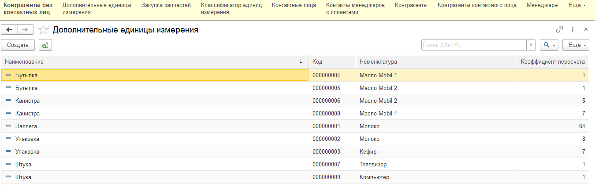
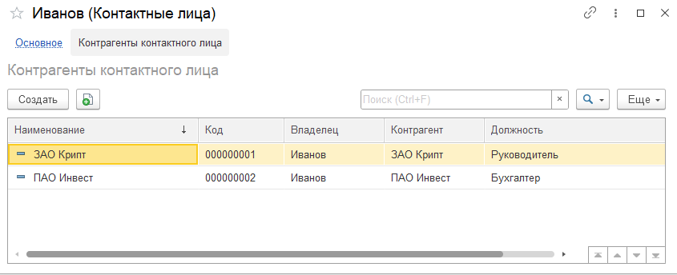
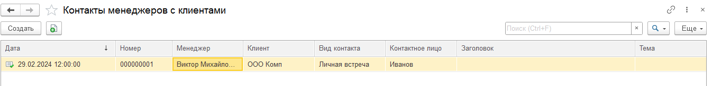
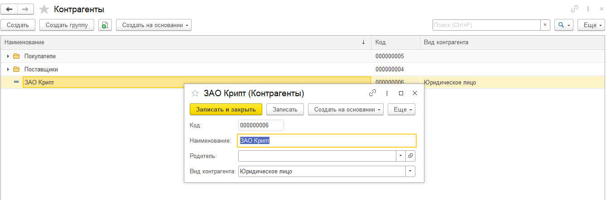
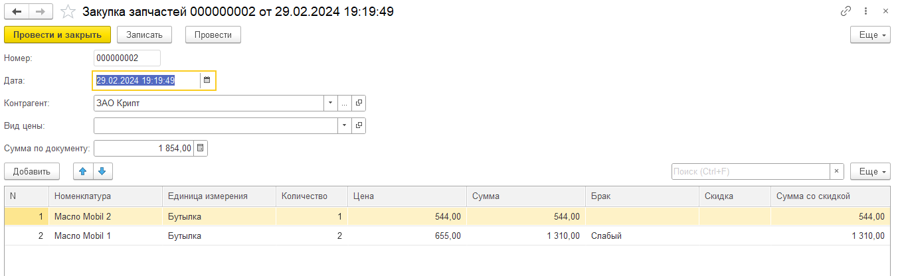
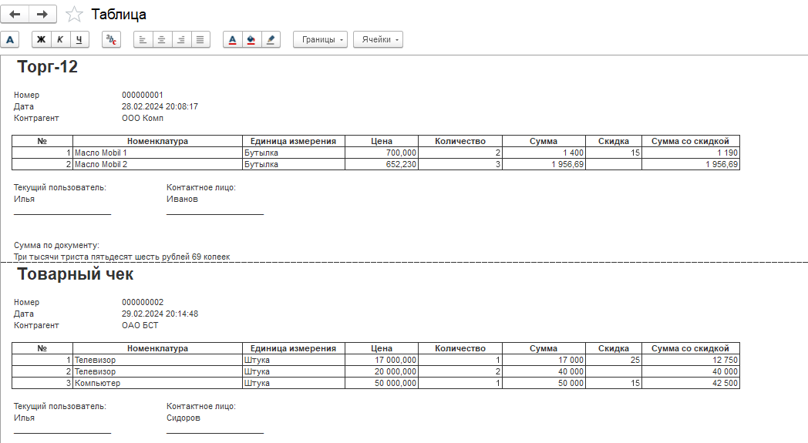

## Task 

1.Создайте справочники «Контрагенты» и «Контактные лица». Для контрагентов должна быть определена иерархия групп и элементов. Для контактного лица определены реквизиты день рождения и телефон.

Необходимо обеспечить, чтобы одно и то же контактное лицо могло быть определено для разных контрагентов. Например, Иванова Мария является главным бухгалтером организации «Альфа» и кассиром организации «Бетта». В системе должно быть прозрачно видно:
В каких организациях и на какой должности работает Иванова Мария.
Кто является кассиром, главным бухгалтером, Генеральным директором в организации «Альфа».

Нужно хранить информацию о том, в какой должности числится контактное лицо для определенного контрагента.

2.Создайте справочник «Номенклатура» и «Классификатор единиц измерения». Справочник «Номенклатура» должен быть иерархическим. Для номенклатуры определите реквизиты:
Вид номенклатуры, выбирается одно из трех, жестко заданных, значений – товар, услуга, набор. Данный реквизит должен быть доступен как для элементов, так и для групп.
Базовая единица измерения, выбирается из классификатора единиц.

Оба реквизита являются обязательными для заполнения. Но если в качестве вида номенклатуры указана услуга, то базовую единицу измерения можно не заполнять.

При создании элемента справочника нужно анализировать определен ли вид номенклатуры у родительской группы. Если да, то нужно подставить данный вид для нового элемента.

Необходимо учесть, что товар может закупаться и продаваться не только в базовых единицах измерения. Для этого нужно создать объект, в котором будут храниться список доступных для номенклатуры единиц измерения. Кроме того, необходимо хранить коэффициент пересчета текущей единицы в базовую. Например, для номенклатуры «Молоко 2,5% пак.» базовой единицей является «Пакет». Но кроме того могут быть определены единицы «Упаковка», в которой содержится 8 пакетов, и паллета, содержащая 64 пакета.

3.Создайте служебную обработку «Проверка контрагентов». При нажатии на кнопку «Выполнить» система должна выдавать список тех контрагентов, у которых не задано контактное лицо. При этом группы справочника контрагенты не должны обрабатываться.

Обеспечьте, чтобы при записи элемента справочника номенклатура создавалась единица измерения с коэффициентом 1, соответствующая базовой единице (дублирования не нужно допускать). Например, для товара «Масло Mobil 1» указана базовая единица «Бутылка», при записи элемента нужно создать единицу измерения с таким же наименованием, подчиненную этой номенклатуре, с указанием на соответствующую базовую единицу, и коэффициентом 1.

Разработайте структуру данных (создайте необходимые справочники и документы в конфигурации с выполненными прошлыми заданиями, регистры пока создавать не нужно) для решения следующей задачи.
Автомагазин занимается закупкой запчастей и их реализацией. При этом закупка может осуществляться напрямую от поставщика, либо через подотчетное лицо (собственного сотрудника). Необходимо обеспечить, чтобы при поступлении можно было указать единицу измерения отличную от базовой.

Товар может поступать бракованным, этот факт необходимо отражать в документе закупки. При этом нужно учесть, что брак может быть различных степеней, которые могут создавать пользователи самостоятельно. В дальнейшем нужно будет обеспечить учет товара на складе с различными степенями брака. Бракованный товар может продаваться покупателям (со скидкой).
Реализация запчастей может производиться как юридическим, так и физическим лицам. Для каждой отгрузки необходимо указывать контрактное лицо контрагента (обязательный для заполнения реквизит).

Обработку проведения документов пока не требуется реализовывать. 
В организации фиксируются все контакты менеджеров с клиентами:
- Личные встречи;
- Телефонные звонки;
- Письма.

Для всех контактов необходимо хранить: контактное лицо, заголовок (строка, 80 символов) и тему (поле неограниченной длины).
Необходимо обеспечить ввод документов поступления и реализации на основании элементов справочника «Контрагенты». При этом нужно предусмотреть следующий алгоритм: при вводе на основании новый документ должен заполняться данными последнего проведенного документа по текущему контрагенту.

Необходимо обеспечить печать документа отгрузки: в шапке название документа и его номер, в строках – все данные из табличной части документа. При этом для юридических лиц название документа «Торг-12», а для физических – «Товарный чек». В подвале печатной формы предусмотреть место для подписей: со стороны организации подставлять текущего пользователя, со стороны клиента – ФИО контактного лица. Также в подвале необходимо печатать сумму документа прописью (пример, Три тысячи двести сорок два рубля 23 копейки).

---

## Screens of solution



---



---



---



---


---



---


---



---

## Code of modules

### Processing of counterparty verification
```
&НаСервере
Процедура ПриСозданииНаСервере(Отказ, СтандартнаяОбработка)
	Если Параметры.Свойство("Контрагенты") Тогда
		Объект.Контрагенты.Очистить();
		Для Каждого Контрагент Из Параметры.Контрагенты Цикл
			НоваяСтрока = Объект.Контрагенты.Добавить();
			НоваяСтрока.Контрагент = Контрагент;
		КонецЦикла;
	КонецЕсли;
КонецПроцедуры


&НаСервере
Процедура ЗаписатьВМассивКотрагентовБезКонтактныхЛиц(ПолученныеКонтрагенты)
	Запрос = Новый Запрос;
	Запрос.Текст = "ВЫБРАТЬ
	|	Контрагенты.Ссылка КАК Ссылка,
	|	КонтрагентыКонтактногоЛица.Ссылка КАК Ссылка1,
	|	КонтрагентыКонтактногоЛица.Контрагент КАК Контрагент
	|ИЗ
	|	Справочник.Контрагенты КАК Контрагенты
	|		ЛЕВОЕ СОЕДИНЕНИЕ Справочник.КонтрагентыКонтактногоЛица КАК КонтрагентыКонтактногоЛица
	|		ПО Контрагенты.Ссылка = КонтрагентыКонтактногоЛица.Контрагент
	|ГДЕ
	|	Контрагенты.ЭтоГруппа = ЛОЖЬ
	|	И ЕСТЬNULL(КонтрагентыКонтактногоЛица.Ссылка, 0) = 0";
	
	Выгрузка = Запрос.Выполнить().Выгрузить();	
	Для Каждого Контрагент Из Выгрузка Цикл
		ПолученныеКонтрагенты.Добавить(Контрагент.Ссылка);	
	КонецЦикла;          	
КонецПроцедуры

&НаКлиенте
Процедура ВыполнитьКоманду(Команда)
	ПолученныеКонтрагенты = Новый Массив;
	ЗаписатьВМассивКотрагентовБезКонтактныхЛиц(ПолученныеКонтрагенты);  
	Объект.Контрагенты.Очистить();
	Для Каждого Контрагент Из ПолученныеКонтрагенты Цикл
		НоваяСтрока = Объект.Контрагенты.Добавить();
		НоваяСтрока.Контрагент = Контрагент;
	КонецЦикла;
КонецПроцедуры
```

---

### Product sales manager module (print)
```
Процедура Печать(ТабДок, Ссылка) Экспорт
	Макет = Документы.Реализация.ПолучитьМакет("Печать");
	ОбластьЗаголовок = Макет.ПолучитьОбласть("Заголовок");     
	ОбластьШапка = Макет.ПолучитьОбласть("Шапка");
	ОбластьЗапчастиШапка = Макет.ПолучитьОбласть("ЗапчастиШапка");
	ОбластьЗапчасти = Макет.ПолучитьОбласть("Запчасти");	
	ОбластьПодвал = Макет.ПолучитьОбласть("Подвал");
	
	ТекущийПользователь = ПользователиИнформационнойБазы.ТекущийПользователь();	
	
	ТабДок.Очистить();
	
	Запрос = Новый Запрос;
	Запрос.Текст = "ВЫБРАТЬ
	|	РеализацияЗапчасти.Ссылка.Ссылка КАК Ссылка,
	|	РеализацияЗапчасти.Ссылка.Дата КАК Дата,
	|	РеализацияЗапчасти.Ссылка.Контрагент КАК Контрагент,
	|	РеализацияЗапчасти.Ссылка.СуммаПоДокументу КАК СуммаПоДокументу,
	|	РеализацияЗапчасти.Номенклатура КАК Номенклатура,
	|	РеализацияЗапчасти.ЕдиницаИзмерения КАК ЕдиницаИзмерения,
	|	РеализацияЗапчасти.Цена КАК Цена,
	|	РеализацияЗапчасти.Количество КАК Количество,
	|	РеализацияЗапчасти.Сумма КАК Сумма,
	|	РеализацияЗапчасти.Брак КАК Брак,
	|	РеализацияЗапчасти.Скидка КАК Скидка,
	|	РеализацияЗапчасти.СуммаСоСкидкой КАК СуммаСоСкидкой,
	|	РеализацияЗапчасти.Ссылка.Номер КАК Номер,
	|	РеализацияЗапчасти.НомерСтроки КАК НомерСтроки,
	|	РеализацияЗапчасти.Ссылка.КонтактноеЛицо КАК КонтактноеЛицо
	|ИЗ
	|	Документ.Реализация.Запчасти КАК РеализацияЗапчасти
	|ГДЕ
	|	РеализацияЗапчасти.Ссылка В(&Документы)";	
	
	Запрос.УстановитьПараметр("Документы", Ссылка);
	Выборка = Запрос.Выполнить().Выбрать();	
	
	ТекСсылка = "";
	Контрагент = "";
	РеализацияЮр = Новый Структура("Реализация", "Торг-12");
	РеализацияФиз = Новый Структура("Реализация", "Товарный чек");
	Реализация = Новый Структура("Реализация", "Реализация");
	
	Количество = Выборка.Количество();
	Индекс = 0;  
	КонтактноеЛицо = "";
	СуммаПоДокументу = 0; 
	ТекущийПользователь = ПользователиИнформационнойБазы.ТекущийПользователь();
	Пока Выборка.Следующий() Цикл
		Если ТекСсылка <> Строка(Выборка.Ссылка) И ТекСсылка <> "" Тогда
			Подвал = Новый Структура;
			Подвал.Вставить("ПодписьТекущегоПользователя", ТекущийПользователь);
			Подвал.Вставить("ПодписьКонтактногоЛица", КонтактноеЛицо); 
			СуммаПрописью = ЧислоПрописью(СуммаПоДокументу, "ДП = Ложь", "рубль, рубля, рублей, м, копейка, копейки, копеек, ж, 2" );		
			Подвал.Вставить("СуммаПоДокументу", СуммаПрописью);
			ОбластьПодвал.Параметры.Заполнить(Подвал);
			ТабДок.Вывести(ОбластьПодвал);
			ТабДок.ВывестиГоризонтальныйРазделительСтраниц();
		КонецЕсли;
		
		Если Контрагент <> Выборка.Контрагент.Наименование Тогда
			ОбластьЗаголовок = Макет.ПолучитьОбласть("Заголовок");     
			ВидКонтрагента = Выборка.Контрагент.ВидКонтрагента;
			Если ВидКонтрагента = Перечисления.ВидКонтрагента.ЮридическоеЛицо Тогда 
				ОбластьЗаголовок.Параметры.Заполнить(РеализацияЮр);
			ИначеЕсли ВидКонтрагента = Перечисления.ВидКонтрагента.ФизическоеЛицо Тогда
				ОбластьЗаголовок.Параметры.Заполнить(РеализацияФиз);  
			Иначе
				ОбластьЗаголовок.Параметры.Заполнить(Реализация);
			КонецЕсли;
			
			ТабДок.Вывести(ОбластьЗаголовок);
			ОбластьШапка.Параметры.Заполнить(Выборка);
			ТабДок.Вывести(ОбластьШапка, Выборка.Уровень());
			ТабДок.Вывести(ОбластьЗапчастиШапка);
		КонецЕсли;
		
		ОбластьЗапчасти.Параметры.Заполнить(Выборка);
		ТабДок.Вывести(ОбластьЗапчасти, Выборка.Уровень());
		
		ТекСсылка = Строка(Выборка.Ссылка);
		Контрагент = Выборка.Контрагент.Наименование; 
		СуммаПоДокументу = Выборка.СуммаПоДокументу;
		КонтактноеЛицо = Выборка.КонтактноеЛицо;
		
		Индекс = Индекс + 1;
		Если Индекс = Количество Тогда
			Подвал = Новый Структура;
			Подвал.Вставить("ПодписьТекущегоПользователя", ПользователиИнформационнойБазы.ТекущийПользователь());
			Подвал.Вставить("ПодписьКонтактногоЛица", Выборка.КонтактноеЛицо); 
			СуммаПрописью = ЧислоПрописью(Выборка.СуммаПоДокументу, "ДП = Ложь", "рубль, рубля, рублей, м, копейка, копейки, копеек, ж, 2" );		
			Подвал.Вставить("СуммаПоДокументу", СуммаПрописью);
			ОбластьПодвал.Параметры.Заполнить(Подвал);
			ТабДок.Вывести(ОбластьПодвал);
		КонецЕсли;
	КонецЦикла; 
КонецПроцедуры
```

---

### Counting sum of documents
```
Процедура РассчитатьСумму(Запчасти, Объект) Экспорт
	Запчасти.Сумма = Запчасти.Цена * Запчасти.Количество;	
	Запчасти.СуммаСоСкидкой = (100 - Запчасти.Скидка) / 100 * Запчасти.Сумма;
	Объект.СуммаПоДокументу = Объект.Запчасти.Итог("СуммаСоСкидкой");
КонецПроцедуры
```

### Input based on
```

Процедура ВводНаОсновании(ДанныеЗаполнения, ЭтотОбъект, ТипДокумента) Экспорт  
	Если ТипЗнч(ДанныеЗаполнения) = Тип("СправочникСсылка.Контрагенты") Тогда
		ЭтотОбъект.Контрагент = ДанныеЗаполнения.Ссылка;
		ТекстЗапроса = "ВЫБРАТЬ ПЕРВЫЕ 1
		|	ЗакупкаЗапчастей.Ссылка КАК Ссылка,
		|	ЗакупкаЗапчастей.Дата КАК Дата
		|ПОМЕСТИТЬ ВременнаяТаблица
		|ИЗ
		|	Документ.ЗакупкаЗапчастей КАК ЗакупкаЗапчастей
		|ГДЕ
		|	ЗакупкаЗапчастей.Контрагент = &Контрагент
		|
		|УПОРЯДОЧИТЬ ПО
		|	Дата УБЫВ
		|;
		|
		|////////////////////////////////////////////////////////////////////////////////
		|ВЫБРАТЬ
		|	ЗакупкаЗапчастейЗапчасти.Ссылка.Ссылка КАК Ссылка,
		|	ЗакупкаЗапчастейЗапчасти.Ссылка.Дата КАК Дата,
		|	ЗакупкаЗапчастейЗапчасти.Ссылка.Контрагент КАК Контрагент,
		|	ЗакупкаЗапчастейЗапчасти.Ссылка.СуммаПоДокументу КАК СуммаПоДокументу,
		|	ЗакупкаЗапчастейЗапчасти.Номенклатура КАК Номенклатура,
		|	ЗакупкаЗапчастейЗапчасти.ЕдиницаИзмерения КАК ЕдиницаИзмерения,
		|	ЗакупкаЗапчастейЗапчасти.Цена КАК Цена,
		|	ЗакупкаЗапчастейЗапчасти.Количество КАК Количество,
		|	ЗакупкаЗапчастейЗапчасти.Сумма КАК Сумма,
		|	ЗакупкаЗапчастейЗапчасти.Брак КАК Брак,
		|	ЗакупкаЗапчастейЗапчасти.Скидка КАК Скидка,
		|	ЗакупкаЗапчастейЗапчасти.СуммаСоСкидкой КАК СуммаСоСкидкой
		|ИЗ
		|	ВременнаяТаблица КАК ВременнаяТаблица
		|		ВНУТРЕННЕЕ СОЕДИНЕНИЕ Документ.ЗакупкаЗапчастей.Запчасти КАК ЗакупкаЗапчастейЗапчасти
		|		ПО ВременнаяТаблица.Ссылка = ЗакупкаЗапчастейЗапчасти.Ссылка";
		
		Если ТипДокумента = "Реализация" Тогда
			ТекстЗапроса = СтрЗаменить(ТекстЗапроса, "ЗакупкаЗапчастейЗапчасти", "РеализацияЗапчасти");	
			ТекстЗапроса = СтрЗаменить(ТекстЗапроса, "ЗакупкаЗапчастей", "Реализация");	
			
			ИндексСтрокиДляВставки = СтрНайти(ТекстЗапроса, "РеализацияЗапчасти.Ссылка.Контрагент КАК Контрагент");
			ДобавленнаяСтрока = "РеализацияЗапчасти.Ссылка.КонтактноеЛицо КАК КонтактноеЛицо, ";
			
			НовыйТекстЗапроса = Лев(ТекстЗапроса, ИндексСтрокиДляВставки - 1) + " " + ДобавленнаяСтрока + 
			Сред(ТекстЗапроса, ИндексСтрокиДляВставки);
			
			ТекстЗапроса = НовыйТекстЗапроса;	
		КонецЕсли;                  
		
		Запрос = Новый Запрос;  
		Запрос.Текст = ТекстЗапроса;
		Запрос.УстановитьПараметр("Контрагент", ЭтотОбъект.Контрагент);
		Выгрузка = Запрос.Выполнить().Выгрузить();
		Если Выгрузка.Количество() > 0 Тогда
			ЭтотОбъект.СуммаПоДокументу = Выгрузка[0].Ссылка.СуммаПоДокументу;
			Если ТипДокумента = "Реализация" Тогда
				ЭтотОбъект.КонтактноеЛицо = Выгрузка[0].Ссылка.КонтактноеЛицо;
			КонецЕсли;
			ЭтотОбъект.Запчасти.Загрузить(Выгрузка);
		КонецЕсли;
	КонецЕсли;
	
КонецПроцедуры
```
