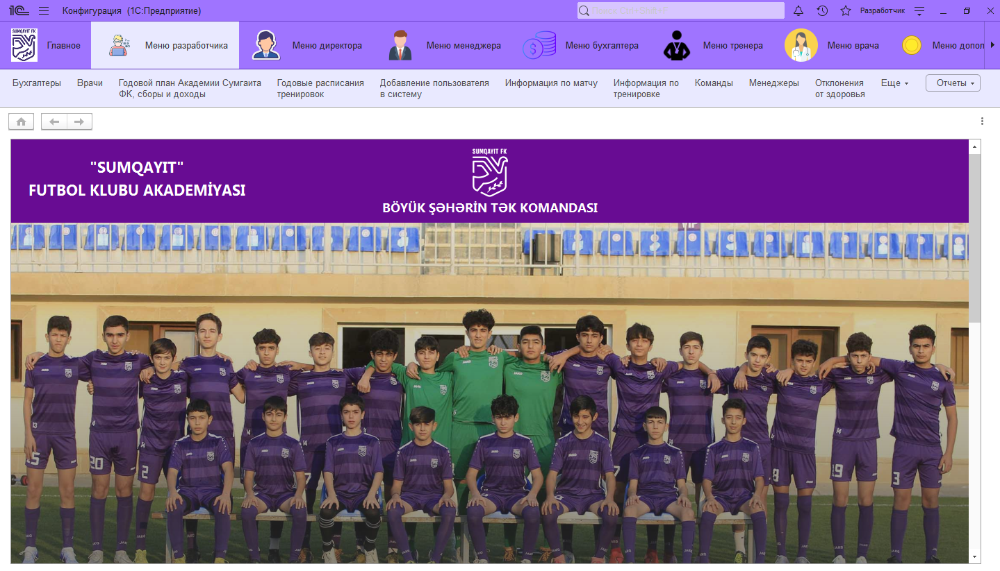
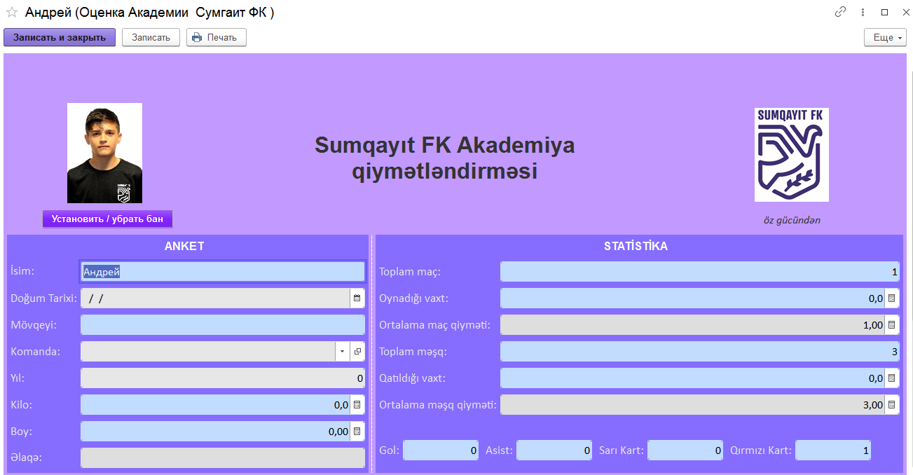
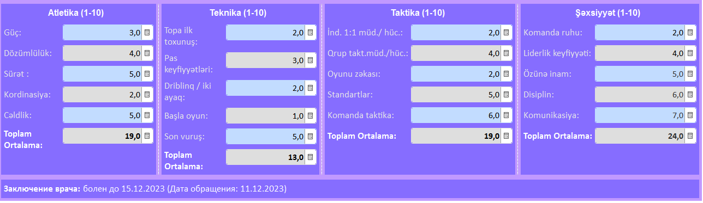
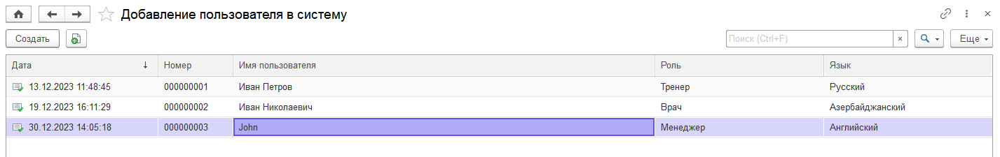
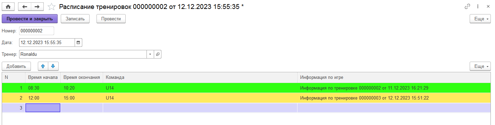
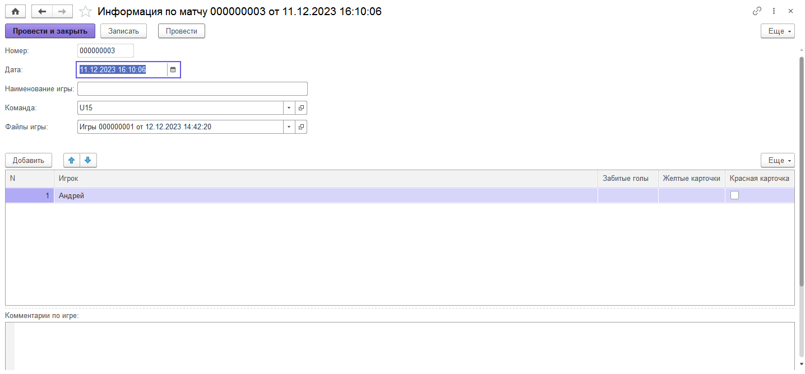

# Некоторые компоненты созданной системы для футбольного клуба

## Интерфейс начальной страницы

## Интерфейс формы с информацией игрока

## Список добавленных пользователей системы, с указанием языка интерфейса, именем пользователя и его ролью

## Расписание тренировок, с цветным отображением уровня нагрузки 

## Информация по матчу, с возможностью загрузки и хранения любых файлов в системе, например документы с анализом матча, плана и протоколами 

