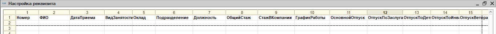
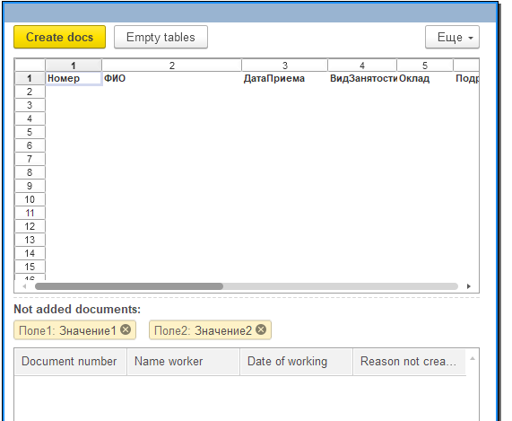
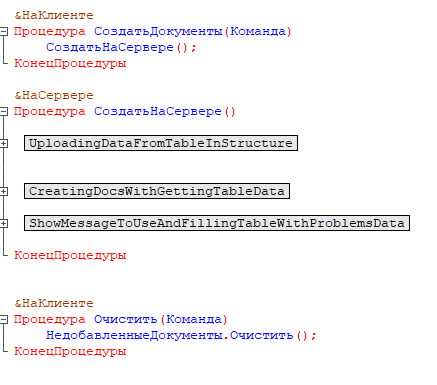

1. Реквизиты формы

2. Открытие настройки реквизита – ТабДок (отображение заголовков полей табличного документа)

3. Элементы формы

4. Модуль формы

5. Модуль формы с открытой областью создания документов

