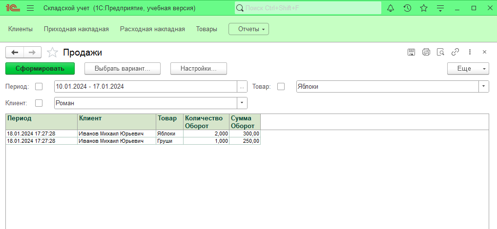

# Учебная настройка сладского учета  

## Задание  

Разработка должна вестись "с нуля", т.е. создать новую конфигурацию.

1.Справочники

  1.1.Товары

  1.1.1.Основное представление в виде наименования(длина 100)

  1.1.2.Реквизиты
  - Цена(15.2)

  1.1.3.Перед записью элемента справочника проверять уникальность наименования, если наименование не уникально, запись производится на должна с выдачей соответствующего сообщения

  1.2.Клиенты

  1.2.1.Основное представление в виде наименования (длина 100)

2.Документы:

  2.1.1.Реквизиты документа: Клиент (справочник "Клиенты")

  2.1.2.Реквизиты табличной части: товар(справочник "Товары"), цена, кол-во, сумма. При выборе товара цена автоматически подставляется из справочника, при изменении количества и цены пересчитывается сумма.

  2.1.3.Сделать печатную форму накладной. Строки в печатной форме по выбору польователя могут быть упорядочены (по возрастанию):
  - По длине наименования товара
  - По наименованию товара
  - По цене

  2.1.4.Сделать движения документа по регистру накопления "Продажи"

3.Регистры накопления

  3.1.Продажи. Оборотный регистр.

  3.1.1.Измерения: товар(справочник "Товары"), клиент (справочник "Клиенты")

  3.1.2.Ресурсы: количество(15.3), сумма (15.2)

4.Отчеты:

  4.1.Отчет по продажам. Формируется по регистру "Продажи". Реализовать возможность отбора по периоду, товару, клиенту.

## Демонстрационная версия реализации

### Отчет по продажам

## Решение

[Решение в виде dt](Solution.dt)
