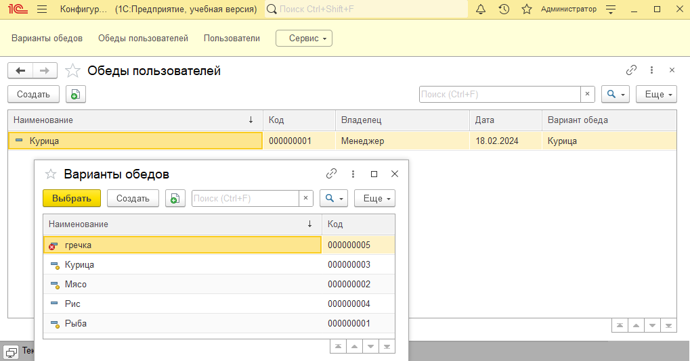

## Task

Предприятие работает ежедневно по графику с 9.00 до 18.00.

При входе пользователя в конфигурацию необходимо проверять соответствует ли текущее время рабочему. Если нет, то выдавать пользователю сообщение о том, что сейчас заходить в конфигурацию нельзя и делать безусловный выход из системы. То есть конфигурацию не удастся запустить в нерабочее время.

Если вход произошел успешно, необходимо запросить у пользователя, какой обед он предпочитает. Доступно три вида обедов: курица, рыба, мясо. 

Пользователь может выбирать сразу несколько вариантов. Для осуществления выбора используйте объект «Список значений». Результат выбора необходимо хранить в виде глобальной переменной «глОбед», где содержится массив строк.

При выходе пользователя из системы необходимо проверять закончился ли рабочий день. Если нет, то задать вопрос о целесообразности покидания системы до окончания рабочего дня. В зависимости от ответа пользователя необходимо закрывать программу, либо оказываться от этого действия.

Необходимо хранить время начала и окончания рабочего дня предприятия в константах. Создайте справочник «Варианты обедов». Занесите в него предопределенные элементы
- Рыба;
- Мясо;
- Курица.

Создайте роль, которая будет содержать права на все объекты. Для роли отметьте признак установки полных прав на новые объекты.

В списке пользователей создайте двух пользователей с полными правами:
- Администратор;
- Менеджер.

Создайте справочник «Пользователи», в нем определите реквизит «Администратор» булевского типа.

Создайте справочник «ОбедыПользователей», подчиненный «Пользователям».

Определите реквизиты:
- Дата;
- Вариант обеда (ссылка на соответствующий справочник).

Справочник «Пользователи» должен автоматически синхронизироваться со списком пользователей. Для этого при старте приложения проверяйте есть ли текущий пользователь в справочнике. Если нет, его нужно программно добавить. Синхронизация должна производиться по имени пользователя.

Опираясь на эти данные, модифицируйте алгоритмы:
- Проверка при входе и выходе не должна осуществляться для пользователей с флагом «Администратор»;
- Время работы предприятия берется из констант;
- Варианты обеда берутся из одноименного справочника (как минимум 3 варианта, но пользователь может добавить собственные). Причем из справочника нужно выбирать элементы, не помеченные на удаление;
- Результат выбора пользователя записывайте в подчиненный справочник.

## Screens of solution

