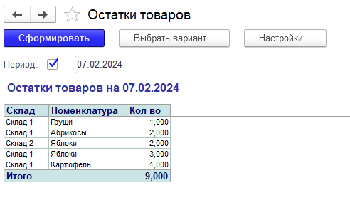
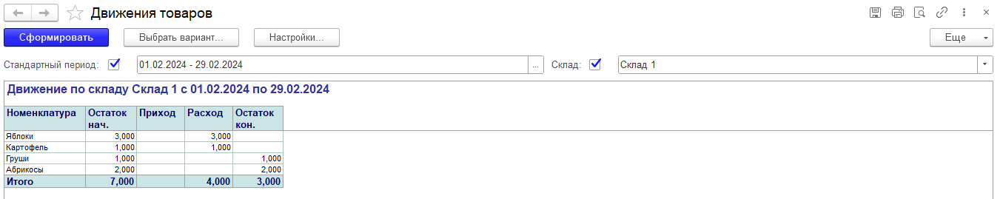

# ОПЕРАТИВНЫЙ УЧЕТ

## Задание:     
	Компания занимается производством и торговлей. 
	Приход продукции на склад отражается документом «Выпуск готовой продукции», расход - документом «Расходная накладная». 
	Учет товаров ведется в разрезе складов. Поступление и продажа осуществляются с указанием склада.
	На продукцию документом «Прейскурант цен» устанавливается цена.
	При реализации в документ «Расходная накладная» должна “подтягиваться” цена, установленная прейскурантом.  

## Необходимо:
	- отразить факт Выпуска продукции
	- установить цены реализации
	- отразить факт Реализации продукции 
	- построить Отчет отражающий движение товаров по складу за период (с выбором склада)
	- Отчет по остаткам товара на складах на указанную дату.  

В форме документа «Расходная накладная» необходимо:
- реализовать автоматическое вычисление суммы по строке табличной части документа при вводе в эту строку количества продаваемого товара или его цены
- сделать расчет общей суммы по документу.

**Движение по складу <Склад> с <ДатаНачальная> по <ДатаКонечная>**

| Номенклатура | Остаток нач. | Приход  | Расход  | Остаток кон. | 
| ------------ | ------------ | ------- | ------- | ------------ |
|              |              |         |         |              |
|              |              |         |         |              |

**Остатки товаров на 01.01.2009**

| Склад | Номенклатура | Кол-во  | 
| ----- | ------------ | ------- |
|       |              |         |
|       |              |         |
  

## Демонстрационная версия реализации: 

### Расходная накладная

  

---

### Остатки товаров

  

---

### Движения товаров

---

## Решение

[Решение в виде dt](Solution.dt)

