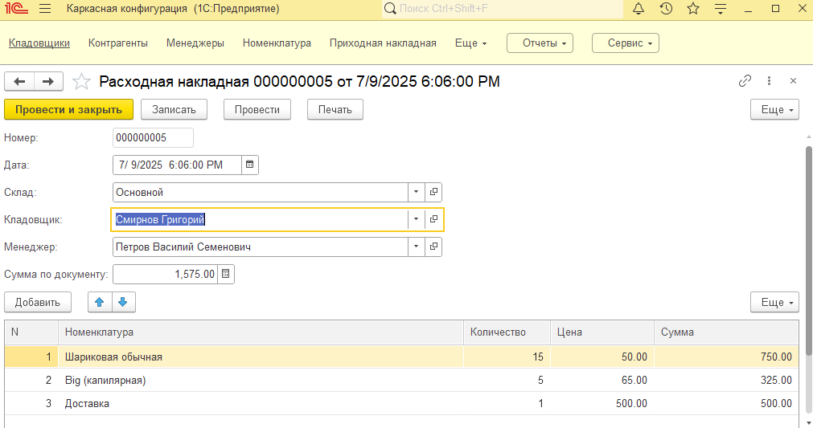

## Задание

Компания занимается оптовой торговлей. Поступление товаров отражается документом «Приходная накладная», продажа — «Расходная накладная».

Помимо продажи товара, могут оказываться дополнительные услуги, например, по доставке. И услуги, и товары указываются в одной табличной части. Услуги могут быть оказаны и при поступлении товаров.

Учет товаров ведется в разрезе складов. Поступление и продажа осуществляются с указанием склада — в шапке документа. 

Для каждого менеджера по продажам есть показатель - процент с суммы продаж. Процент может меняться не чаще 1 раза в месяц, и устанавливается в первое число месяца. Процент не может превышать значение, задаваемое константой Максимальный процент продаж.

При проведении Расходной накладной необходимо выполнить контроль, что остатка товара достаточно. Если остатка недостаточно - вывести предупреждение и отказаться от проведения. 

Добавить отчет:

Продажи по менеджерам - для каждого менеджера, у которого за указанный период были продажи, выводится итоговое Количество проданного товара, Сумма продажи и Сумма вознаграждения за указанный период. В отчете должна быть возможность сделать отбор по менеджеру.

Дополнительно (выполнить по желанию):
У каждого склада есть ответственный кладовщик. Для Расходной накладной необходимо реализовать произвольную печатную форму “Расходная накладная”, с указанием списка реализуемых товаров и ФИО кладовщика, назначенного ответственным по складу на дату документа.

Добавить отчет:
Продажи  - Включает колонки Номенклатура, Количество,  Сумма за указанный в отчете период

## Решение

  

 

  

  

  

  

## Что было добавлено еще:

1. Изменение стиля и добавление журнала документов для накладных с складом и суммой по документу

  

2. Подсчет суммы для регистров для одинаковых товаров документа и отображение регистров в документе
 
  

  

  

  

3. Добавлена диаграмма для продаж менеджеров по сумме и формирование отчета продаж сразу при открытии 

  

[Решение в виде dt](Solution.dt)
